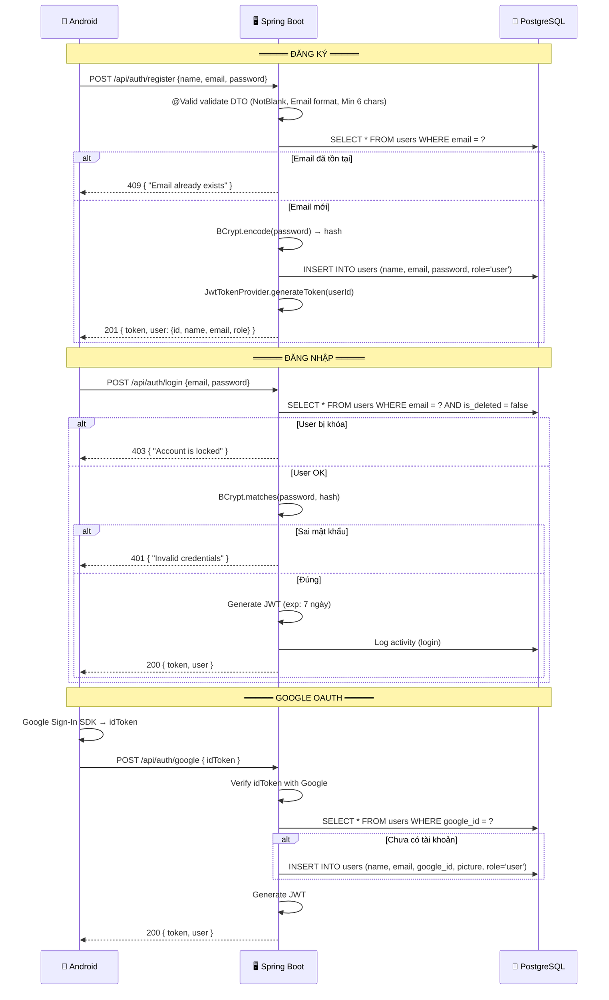
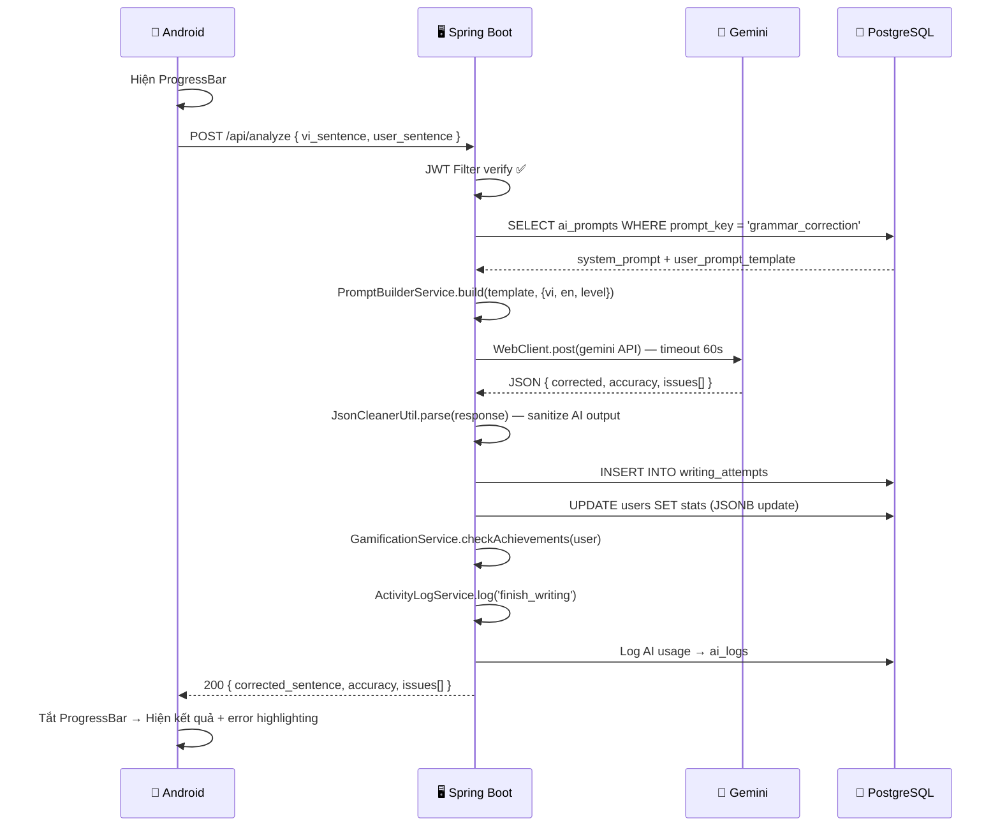
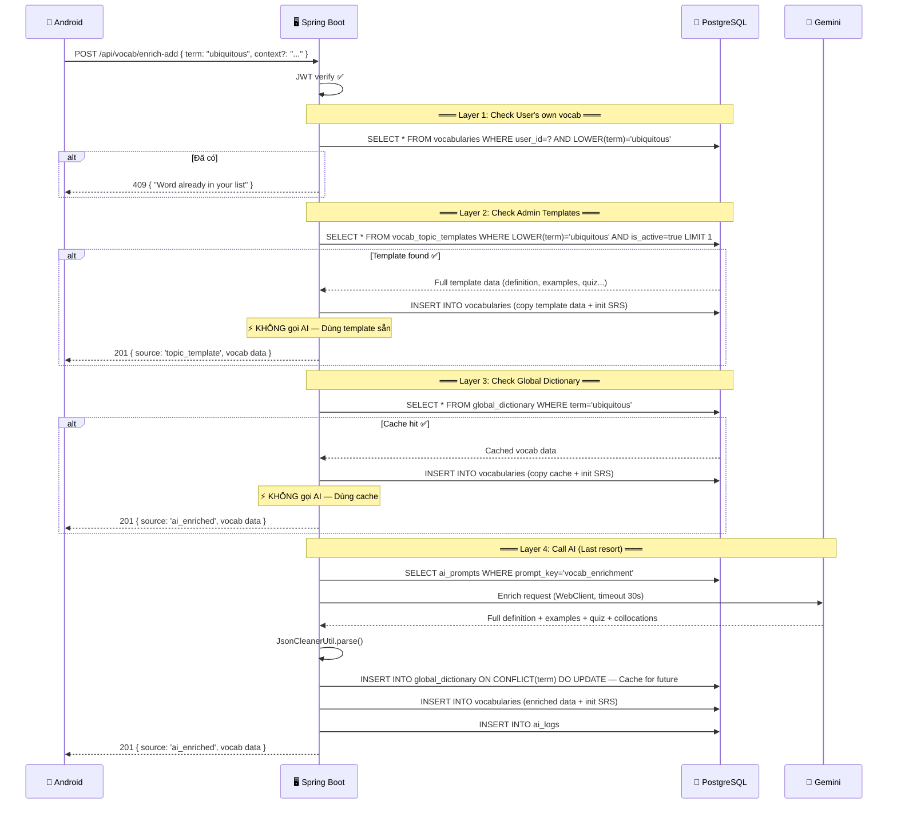
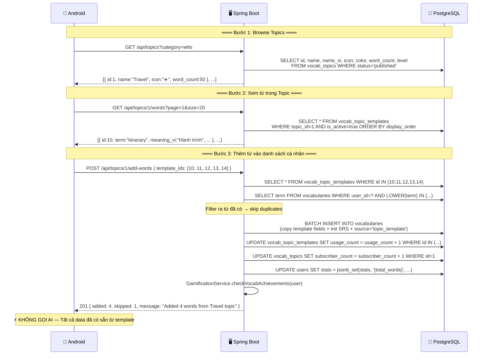
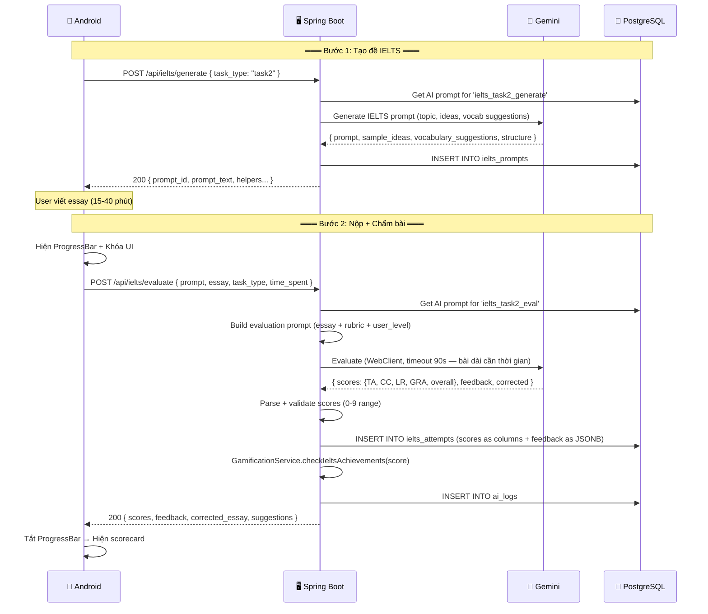
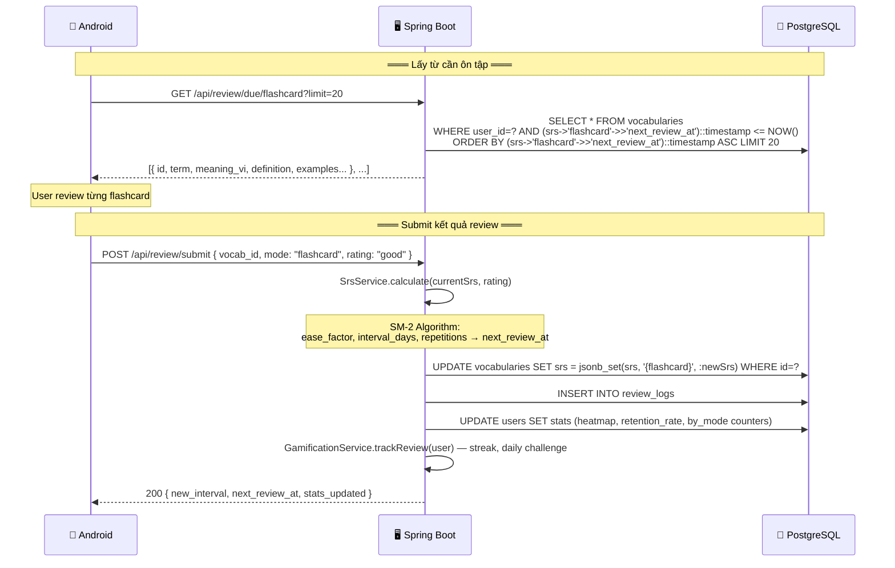
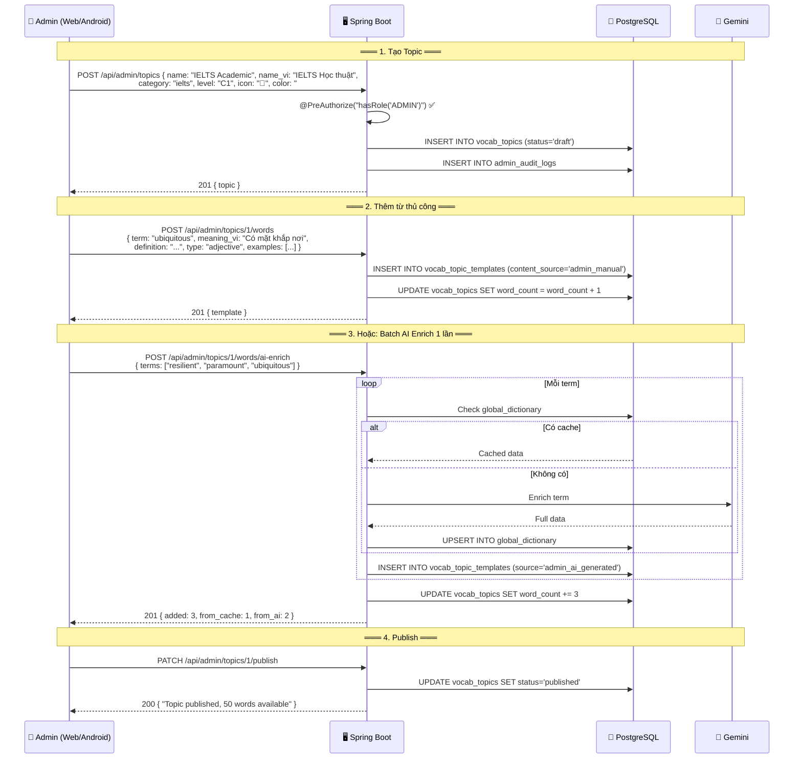

# 🏗️ Kiến Trúc Chi Tiết: Android App + Spring Boot + PostgreSQL

> **Triết lý:** Pragmatic Indie Developer — Đơn giản, Rẻ, Lên được Store.
> **Quy mô:** < 1000 users | Cá nhân / MVP | Budget ≈ $0/tháng
> **Tài liệu liên quan:** [database_design.md](file:///C:/Users/Acer%20Nitro%205/.gemini/antigravity/brain/243a6d7c-7763-479b-9911-8a35e7561569/database_design.md)

---

## 1. Cấu Trúc Thư Mục Spring Boot — Đầy Đủ

> Mapping 1:1 từ project Node.js hiện tại sang Java packages.

```
src/main/java/com/yourapp/
│
├── config/                                  ← [backend/config/]
│   ├── SecurityConfig.java                  # Spring Security filter chain + JWT
│   ├── CorsConfig.java                      # CORS cho Android app
│   ├── WebClientConfig.java                 # Bean WebClient gọi Gemini API
│   └── JacksonConfig.java                   # JSON serialization config (JSONB support)
│
├── security/                                ← [backend/middleware/authMiddleware.js + adminMiddleware.js]
│   ├── JwtTokenProvider.java                # Tạo & verify JWT token
│   ├── JwtAuthenticationFilter.java         # OncePerRequestFilter — check Bearer token
│   ├── CustomUserDetailsService.java        # Load user từ DB cho Spring Security
│   └── SecurityUtils.java                   # Helper: getCurrentUser(), isAdmin()
│
├── filter/                                  ← [backend/middleware/]
│   ├── RateLimitFilter.java                 # ← rateLimiter.js (generalLimiter, aiLimiter, authLimiter)
│   ├── InputSanitizationFilter.java         # ← security.js (sanitizeInput)
│   └── SecurityHeaderFilter.java            # ← security.js (securityHeaders, customSecurity)
│
├── controller/                              ← [backend/controllers/] + [backend/routes/]
│   │
│   │  # ── AUTH & USER ──
│   ├── AuthController.java                  # ← authController.js
│   │   # POST   /api/auth/register
│   │   # POST   /api/auth/login
│   │   # POST   /api/auth/google
│   │   # GET    /api/auth/me
│   │   # PUT    /api/auth/profile
│   │   # GET    /api/auth/leaderboard
│   │
│   │  # ── WRITING & ANALYSIS ──
│   ├── WritingController.java               # ← analyzeController.js + writingRoutes (analyze part)
│   │   # POST   /api/analyze                 → analyzeSentence (AI grammar check)
│   │   # POST   /api/vocab/analyze            → analyzeVocabulary (AI vocab analysis)
│   │   # POST   /api/hint                     → getHint
│   │   # GET    /api/stats                    → getStats (writing stats)
│   │
│   │  # ── VOCABULARY ──
│   ├── VocabularyController.java            # ← vocabularyController.js
│   │   # GET    /api/vocab                    → getVocabulary (user's word list)
│   │   # POST   /api/vocab                    → saveVocabulary
│   │   # POST   /api/vocab/add                → addVocabulary
│   │   # POST   /api/vocab/enrich             → enrichVocabulary (AI enrich single)
│   │   # POST   /api/vocab/bulk-enrich        → bulkEnrichVocabulary (sync)
│   │   # POST   /api/vocab/bulk-enrich-async  → bulkEnrichVocabularyAsync
│   │   # POST   /api/vocab/bulk-delete        → deleteManyVocabulary
│   │   # DELETE /api/vocab/{id}               → deleteVocabulary
│   │   # POST   /api/vocab/{id}/reset         → resetVocabulary (reset SRS)
│   │   # GET    /api/decks                    → getDecks
│   │   # GET    /api/quiz                     → getReviewQuiz
│   │   # POST   /api/review                   → submitReview (legacy)
│   │
│   │  # ── VOCABULARY ENRICHMENT (standalone) ──
│   ├── VocabEnrichController.java           # ← vocabularyRoutes.js (enrichAndAddWord)
│   │   # POST   /api/vocab/enrich-add         → enrichAndAddWord (AI + dictionary lookup)
│   │
│   │  # ── IELTS ──
│   ├── IeltsController.java                 # ← ieltsController.js
│   │   # POST   /api/ielts/generate           → generatePrompt (AI tạo đề)
│   │   # POST   /api/ielts/generate-outline   → generateOutline
│   │   # POST   /api/ielts/evaluate           → evaluateEssay (AI chấm bài)
│   │   # POST   /api/ielts/speaking/evaluate  → evaluateSpeaking (audio upload)
│   │   # GET    /api/ielts/history            → getHistory (paginated)
│   │   # GET    /api/ielts/stats              → getStats
│   │   # GET    /api/ielts/prompts            → getPromptHistory
│   │   # GET    /api/ielts/prompt/{id}        → getPromptDetail
│   │   # GET    /api/ielts/attempt/{id}       → getAttemptById
│   │
│   │  # ── REVIEW (SRS) ──
│   ├── ReviewController.java                # ← reviewController.js
│   │   # GET    /api/review/due/{mode}        → getDueWords (flashcard/quiz/typing/listening)
│   │   # POST   /api/review/submit            → submitReview (SRS algorithm)
│   │   # GET    /api/review/dashboard         → getDashboard (SRS overview stats)
│   │   # POST   /api/review/custom-session    → createCustomSession
│   │
│   │  # ── ARTICLE (Reading) ──
│   ├── ArticleController.java               # ← articleController.js
│   │   # GET    /api/articles/random          → getRandomArticle
│   │   # GET    /api/articles/history         → getRecentArticles
│   │   # GET    /api/articles/{id}            → getArticleById
│   │
│   │  # ── GAMIFICATION ──
│   ├── GamificationController.java          # ← gamificationController.js
│   │   # GET    /api/gamification/achievements      → getAchievements
│   │   # GET    /api/gamification/daily-challenges   → getDailyChallenges
│   │   # POST   /api/gamification/claim-daily-bonus  → claimDailyBonus
│   │   # GET    /api/gamification/analytics          → getAnalytics
│   │
│   │  # ── ANALYTICS (User Dashboard) ──
│   ├── AnalyticsController.java             # ← analyticsController.js
│   │   # GET    /api/analytics                → getDashboardAnalytics
│   │   # POST   /api/analytics/goals          → updateGoals
│   │
│   │  # ── NOTIFICATIONS ──
│   ├── NotificationController.java          # ← notificationRoutes.js (inline handlers)
│   │   # GET    /api/notifications             → getUserNotifications (paginated)
│   │   # GET    /api/notifications/unread-count → getUnreadCount
│   │   # PUT    /api/notifications/{id}/read   → markAsRead
│   │   # PUT    /api/notifications/read-all    → markAllAsRead
│   │   # DELETE /api/notifications/{id}        → deleteNotification
│   │   # DELETE /api/notifications/read        → deleteReadNotifications
│   │
│   │  # ══════════════════════════════════════
│   │  # 🆕 MỚI: TOPIC-BASED VOCABULARY
│   │  # ══════════════════════════════════════
│   ├── TopicController.java                 # 🆕 User-facing topic APIs
│   │   # GET    /api/topics                   → getPublishedTopics (danh sách chủ đề)
│   │   # GET    /api/topics/{id}              → getTopicDetail
│   │   # GET    /api/topics/{id}/words        → getTopicWords (template list)
│   │   # POST   /api/topics/{id}/add-words    → addWordsFromTopic (copy templates → user vocab, NO AI)
│   │
│   │  # ══════════════════════════════════════
│   │  # ADMIN CONTROLLERS
│   │  # ══════════════════════════════════════
│   ├── admin/
│   │   ├── AdminUserController.java         # ← adminController.js (Users section)
│   │   │   # GET    /api/admin/users            → getUsers (paginated, searchable)
│   │   │   # GET    /api/admin/users/{id}       → getUserDetail
│   │   │   # PUT    /api/admin/users/{id}       → updateUser
│   │   │   # PUT    /api/admin/users/{id}/status → toggleUserStatus (lock/unlock)
│   │   │   # POST   /api/admin/users/{id}/reset  → resetUserProgress
│   │   │   # DELETE /api/admin/users/{id}        → deleteUser (soft delete)
│   │   │
│   │   ├── AdminArticleController.java      # ← adminController.js (Articles section)
│   │   │   # GET    /api/admin/articles
│   │   │   # POST   /api/admin/articles
│   │   │   # PUT    /api/admin/articles/{id}
│   │   │   # DELETE /api/admin/articles/{id}
│   │   │   # CRUD   /api/admin/articles/{id}/questions
│   │   │
│   │   ├── AdminVocabController.java        # ← adminController.js (Vocabulary section)
│   │   │   # GET    /api/admin/vocab              → global vocab list
│   │   │   # GET    /api/admin/vocab/topics       → all vocab topics
│   │   │   # POST   /api/admin/vocab              → create vocab
│   │   │   # PUT    /api/admin/vocab/{id}
│   │   │   # DELETE /api/admin/vocab/{id}
│   │   │   # POST   /api/admin/vocab/import
│   │   │   # GET    /api/admin/vocab/export
│   │   │   # POST   /api/admin/vocab/bulk
│   │   │
│   │   ├── AdminWritingTaskController.java  # ← adminController.js (Writing Tasks)
│   │   │   # CRUD   /api/admin/writing-tasks
│   │   │
│   │   ├── AdminPromptController.java       # ← promptController.js
│   │   │   # CRUD   /api/admin/prompts
│   │   │   # GET    /api/admin/prompts/{key}/versions
│   │   │   # POST   /api/admin/prompts/{key}/rollback
│   │   │   # POST   /api/admin/prompts/{key}/test
│   │   │   # GET    /api/admin/prompts/logs/ai
│   │   │   # GET    /api/admin/prompts/logs/ai/stats
│   │   │
│   │   ├── AdminDashboardController.java    # ← adminController.js (Dashboard)
│   │   │   # GET    /api/admin/stats
│   │   │   # GET    /api/admin/activity-timeline
│   │   │
│   │   ├── AdminAuditController.java        # ← adminController.js (Logs)
│   │   │   # GET    /api/admin/logs/audit
│   │   │   # GET    /api/admin/logs/user
│   │   │
│   │   │  # ══════════════════════════════════
│   │   │  # 🆕 MỚI: ADMIN TOPIC MANAGEMENT
│   │   │  # ══════════════════════════════════
│   │   └── AdminTopicController.java        # 🆕 Admin quản lý Topics & Templates
│   │       # CRUD   /api/admin/topics
│   │       # POST   /api/admin/topics/{id}/words           → thêm template word thủ công
│   │       # POST   /api/admin/topics/{id}/words/ai-enrich → batch AI enrich 1 lần
│   │       # PUT    /api/admin/topics/{id}/words/{wid}     → sửa template word
│   │       # DELETE /api/admin/topics/{id}/words/{wid}
│   │       # PATCH  /api/admin/topics/{id}/publish         → publish topic
│   │       # PATCH  /api/admin/topics/{id}/archive
│   │
│   └── HealthController.java               # ← server.js (/health)
│       # GET    /health
│
├── service/                                 ← [backend/services/] + [backend/controllers/ logic]
│   ├── AuthService.java                     # Register, login, JWT, Google OAuth
│   ├── UserService.java                     # CRUD user, profile, leaderboard
│   ├── WritingService.java                  # AI grammar check, analysis, hints
│   ├── VocabularyService.java               # ← vocabularyService.js — CRUD vocab, deck management
│   ├── VocabEnrichmentService.java          # ← aiService.js logic — AI enrich + cache strategy
│   ├── IeltsService.java                    # Prompt generation, essay evaluation, speaking
│   ├── IeltsPromptBuilderService.java       # ← ieltsPromptBuilder.js — Build AI prompts
│   ├── ReviewService.java                   # ← reviewController.js logic — SRS due words, submit
│   ├── SrsService.java                      # ← srsService.js — SM-2 algorithm calculations
│   ├── QuizService.java                     # ← quizService.js — Quiz generation
│   ├── ArticleService.java                  # Article CRUD, Guardian API fetch
│   ├── GamificationService.java             # Achievements, daily challenges, XP
│   ├── AnalyticsService.java                # Dashboard stats computation
│   ├── NotificationService.java             # ← notificationService.js — Create & manage notifications
│   ├── TranslationService.java              # ← translationService.js — Translation helpers
│   ├── GeminiService.java                   # ← aiService.js — HTTP call to Gemini API via WebClient
│   ├── PromptBuilderService.java            # ← promptBuilder.js — Build system/user prompts
│   ├── AiLogService.java                    # Log AI interactions to DB
│   ├── AiRateLimiterService.java            # ← aiRateLimiter.js — Per-user AI rate limiting
│   ├── ActivityLogService.java              # ← activityLogger.js — Track user actions
│   ├── StatsHelperService.java              # ← statsHelper.js — Update user stats
│   │
│   │  # 🆕 MỚI
│   ├── TopicService.java                    # 🆕 CRUD topics, topic browsing
│   ├── TopicTemplateService.java            # 🆕 CRUD templates, copy-to-user logic
│   └── GlobalDictionaryService.java         # Cache layer — check global_dictionary before AI
│
├── entity/                                  ← [backend/models/]
│   ├── User.java                            # @Entity — users table
│   ├── Vocabulary.java                      # @Entity — vocabularies table (JSONB: srs, quiz)
│   ├── GlobalDictionary.java                # @Entity — global_dictionary table
│   ├── VocabTopic.java                      # 🆕 @Entity — vocab_topics table
│   ├── VocabTopicTemplate.java              # 🆕 @Entity — vocab_topic_templates table
│   ├── WritingTask.java                     # @Entity — writing_tasks table
│   ├── WritingAttempt.java                  # @Entity — writing_attempts table
│   ├── IeltsAttempt.java                    # @Entity — ielts_attempts table
│   ├── IeltsSpeakingAttempt.java            # @Entity — ielts_speaking_attempts table
│   ├── IeltsPrompt.java                     # @Entity — ielts_prompts table
│   ├── Article.java                         # @Entity — articles table
│   ├── ReadingQuestion.java                 # @Entity — reading_questions table
│   ├── ReviewLog.java                       # @Entity — review_logs table
│   ├── AiPrompt.java                        # @Entity — ai_prompts table
│   ├── AiPromptVersion.java                 # @Entity — ai_prompt_versions table
│   ├── AiLog.java                           # @Entity — ai_logs table
│   ├── UserAchievement.java                 # @Entity — user_achievements table
│   ├── UserDailyChallenge.java              # @Entity — user_daily_challenges table
│   ├── Notification.java                    # @Entity — notifications table
│   ├── ErrorPattern.java                    # @Entity — error_patterns table
│   ├── AdminAuditLog.java                   # @Entity — admin_audit_logs table
│   └── UserActivityLog.java                 # @Entity — user_activity_logs table
│
├── repository/                              ← Spring Data JPA Repositories
│   ├── UserRepository.java                  # extends JpaRepository<User, Long>
│   ├── VocabularyRepository.java            # Custom queries: findDueWords, findByUserAndTopic
│   ├── GlobalDictionaryRepository.java
│   ├── VocabTopicRepository.java            # 🆕
│   ├── VocabTopicTemplateRepository.java    # 🆕
│   ├── WritingTaskRepository.java
│   ├── WritingAttemptRepository.java
│   ├── IeltsAttemptRepository.java
│   ├── IeltsSpeakingAttemptRepository.java
│   ├── IeltsPromptRepository.java
│   ├── ArticleRepository.java
│   ├── ReadingQuestionRepository.java
│   ├── ReviewLogRepository.java
│   ├── AiPromptRepository.java
│   ├── AiPromptVersionRepository.java
│   ├── AiLogRepository.java
│   ├── UserAchievementRepository.java
│   ├── UserDailyChallengeRepository.java
│   ├── NotificationRepository.java
│   ├── ErrorPatternRepository.java
│   ├── AdminAuditLogRepository.java
│   └── UserActivityLogRepository.java
│
├── dto/                                     ← Request/Response objects
│   ├── request/
│   │   ├── LoginRequest.java
│   │   ├── RegisterRequest.java
│   │   ├── GoogleLoginRequest.java
│   │   ├── UpdateProfileRequest.java
│   │   ├── VocabAddRequest.java
│   │   ├── VocabEnrichRequest.java
│   │   ├── BulkEnrichRequest.java
│   │   ├── ReviewSubmitRequest.java
│   │   ├── IeltsGenerateRequest.java
│   │   ├── IeltsEvaluateRequest.java
│   │   ├── TopicCreateRequest.java          # 🆕
│   │   ├── TemplateWordRequest.java         # 🆕
│   │   ├── AddFromTopicRequest.java         # 🆕
│   │   └── UpdateGoalsRequest.java
│   └── response/
│       ├── AuthResponse.java                # { token, user }
│       ├── VocabListResponse.java
│       ├── ReviewDashboardResponse.java
│       ├── IeltsEvalResponse.java
│       ├── AnalyticsResponse.java
│       ├── TopicListResponse.java           # 🆕
│       ├── PagedResponse.java               # Generic paginated response
│       └── ApiResponse.java                 # Generic { success, message, data }
│
├── constant/                                ← [backend/models/Achievement.js ACHIEVEMENTS + DailyChallenge TEMPLATES]
│   ├── AchievementDefinitions.java          # Static achievement list (streak, vocab, xp, ielts badges)
│   ├── ChallengeTemplates.java              # Static daily challenge templates
│   └── AiPromptKeys.java                    # Enum: GRAMMAR_CORRECTION, VOCAB_ENRICHMENT, etc.
│
├── aop/                                     ← [backend/middleware/auditMiddleware.js] — Cross-cutting concerns
│   ├── AuditLogAspect.java                  # @Aspect — Auto-log admin actions (AOP thay vì middleware)
│   └── AdminOnly.java                       # Custom @AdminOnly annotation
│
├── scheduler/                               ← [backend/workers/] + [backend/config/agenda.js]
│   ├── LogCleanupScheduler.java             # @Scheduled — Xóa ai_logs (30d), notifications (30d), audit (90d)
│   ├── StatsResetScheduler.java             # @Scheduled — Reset daily/weekly goals counters
│   └── VocabBulkProcessor.java              # @Async — Background vocab enrichment (thay thế Agenda worker)
│
├── util/                                    ← [backend/utils/]
│   ├── JsonCleanerUtil.java                 # ← jsonCleaner.js — Parse AI JSON responses
│   ├── EncryptionUtil.java                  # ← encryption.js — Encrypt/decrypt
│   └── SlugUtil.java                        # Generate URL-safe slugs
│
├── exception/                               ← Global error handling
│   ├── GlobalExceptionHandler.java          # @ControllerAdvice — catch all exceptions
│   ├── ResourceNotFoundException.java
│   ├── UnauthorizedException.java
│   ├── ForbiddenException.java
│   ├── RateLimitException.java
│   └── AiServiceException.java
│
└── WritingPracticeApplication.java          # @SpringBootApplication — Main entry point
```

```
src/main/resources/
├── application.yml                          # Main config (DB, JWT, Gemini, server)
├── application-dev.yml                      # Local dev overrides
├── application-prod.yml                     # Production overrides
└── db/migration/                            # Flyway SQL migrations
    ├── V1__create_users.sql
    ├── V2__create_vocabularies.sql
    ├── V3__create_writing_tables.sql
    ├── V4__create_ielts_tables.sql
    ├── V5__create_review_gamification.sql
    ├── V6__create_ai_admin_tables.sql
    ├── V7__create_vocab_topics.sql          # 🆕
    └── V8__create_vocab_topic_templates.sql # 🆕
```

---

## 2. Mapping Middleware (Express → Spring Boot)

| Express Middleware | Spring Boot Equivalent | File |
|---|---|---|
| [authMiddleware.js](file:///c:/Users/Acer%20Nitro%205/Documents/writing-practice/backend/middleware/authMiddleware.js) (protect) | `JwtAuthenticationFilter` (OncePerRequestFilter) | `security/JwtAuthenticationFilter.java` |
| [adminMiddleware.js](file:///c:/Users/Acer%20Nitro%205/Documents/writing-practice/backend/middleware/adminMiddleware.js) (admin) | `@PreAuthorize("hasRole('ADMIN')")` hoặc custom `@AdminOnly` | `aop/AdminOnly.java` |
| [auditMiddleware.js](file:///c:/Users/Acer%20Nitro%205/Documents/writing-practice/backend/middleware/auditMiddleware.js) (auditLog) | `@Aspect` AOP — auto-log mọi admin action | `aop/AuditLogAspect.java` |
| [rateLimiter.js](file:///c:/Users/Acer%20Nitro%205/Documents/writing-practice/backend/middleware/rateLimiter.js) (generalLimiter, aiLimiter) | `RateLimitFilter` + `bucket4j` library | `filter/RateLimitFilter.java` |
| [security.js](file:///c:/Users/Acer%20Nitro%205/Documents/writing-practice/backend/middleware/security.js) (securityHeaders) | `SecurityHeaderFilter` hoặc `SecurityConfig` | `filter/SecurityHeaderFilter.java` |
| [security.js](file:///c:/Users/Acer%20Nitro%205/Documents/writing-practice/backend/middleware/security.js) (sanitizeInput) | `InputSanitizationFilter` | `filter/InputSanitizationFilter.java` |
| [validators.js](file:///c:/Users/Acer%20Nitro%205/Documents/writing-practice/backend/middleware/validators.js) (validateRegister, etc.) | `@Valid` + `@NotBlank` trên DTO classes | `dto/request/*.java` |

---

## 3. Luồng Xử Lý Chi Tiết Từng Tính Năng

### 3.1. Authentication (Đăng ký / Đăng nhập / Google OAuth)



### 3.2. Writing: Phân tích câu + Gợi ý sửa lỗi



### 3.3. Vocabulary: Thêm từ (3 layers cache)



### 3.4. 🆕 Topic: User thêm từ theo chủ đề (KHÔNG gọi AI)



### 3.5. IELTS: Tạo đề + Chấm bài



### 3.6. SRS Review (Spaced Repetition)



### 3.7. 🆕 Admin: Tạo Topic + Template (Quy trình Admin)



### 3.8. Background Jobs (thay Agenda)

```
Node.js (hiện tại):                     Spring Boot (mới):
─────────────────────                   ──────────────────
Agenda + MongoDB                        @Scheduled + @Async + PostgreSQL

vocabBulkWorker.js                      VocabBulkProcessor.java
  → agenda.define('vocab-bulk')           → @Async processVocabBulk()
  → Xử lý 50 từ/batch                    → Xử lý 50 từ/batch (same logic)
  → Emit Socket.IO progress              → (Android: polling hoặc push notification)

ieltsEvalWorker.js                      Không cần Async — IELTS eval chạy sync
  → Hiện tại chạy sync ổn                → Giữ sync (< 1000 users, 200 threads Spring)

LogCleanup (không có)                   LogCleanupScheduler.java
                                          → @Scheduled(cron = "0 3 * * *")
                                          → DELETE FROM ai_logs WHERE created_at < 30d
                                          → DELETE FROM notifications WHERE created_at < 30d
                                          → DELETE FROM admin_audit_logs WHERE created_at < 90d

StatsReset (không có)                   StatsResetScheduler.java
                                          → @Scheduled(cron = "0 0 * * *")
                                          → Reset daily_vocab_count
                                          → Reset weekly_writing_count (mỗi Chủ nhật)
```

> [!NOTE]
> **Tại sao bỏ Agenda/Queue?** Project hiện tại dùng Agenda + MongoDB thay cho BullMQ + Redis (đã migrate trước đó vì Redis Upstash free tier hết quota). Sang Spring Boot, dùng `@Async` + `@Scheduled` là đủ cho < 1000 users. Nếu sau này cần queue phức tạp → thêm `Spring Batch` hoặc `RabbitMQ`.

---

## 4. Kiến Trúc Android App

### 4.1. Cấu trúc thư mục Android

```
app/src/main/java/com/yourapp/
│
├── ui/                              # Activities & Fragments
│   ├── auth/
│   │   ├── LoginActivity.java
│   │   ├── RegisterActivity.java
│   │   └── GoogleSignInHelper.java
│   ├── main/
│   │   └── MainActivity.java       # BottomNavigation host
│   ├── dashboard/
│   │   └── DashboardFragment.java   # Stats, heatmap, streak
│   ├── writing/
│   │   ├── WritingMenuFragment.java
│   │   ├── WritingEditorFragment.java  # Viết + submit
│   │   └── WritingResultFragment.java  # Xem kết quả AI
│   ├── vocabulary/
│   │   ├── DictionaryFragment.java     # Danh sách từ + search + filter
│   │   ├── VocabDetailFragment.java    # Chi tiết 1 từ
│   │   └── TopicBrowserFragment.java   # 🆕 Browse topics → add words
│   ├── review/
│   │   ├── ReviewMenuFragment.java     # Chọn mode (flashcard/quiz/typing/listening)
│   │   ├── FlashcardFragment.java      # Swipe cards
│   │   ├── QuizFragment.java           # MCQ quiz
│   │   ├── TypingFragment.java         # Type the word
│   │   └── ListeningFragment.java      # Listen & type
│   ├── ielts/
│   │   ├── IeltsMenuFragment.java
│   │   ├── IeltsWritingFragment.java   # Essay editor + timer
│   │   ├── IeltsSpeakingFragment.java  # Record audio
│   │   └── IeltsResultFragment.java    # Scorecard
│   └── profile/
│       ├── ProfileFragment.java        # User info, settings
│       └── LeaderboardFragment.java
│
├── data/                            # Data layer
│   ├── api/
│   │   ├── ApiClient.java           # Retrofit2 + OkHttp singleton
│   │   ├── AuthInterceptor.java     # Gắn JWT Bearer token mỗi request
│   │   ├── AuthApi.java             # Interface: @POST("/api/auth/login"), etc.
│   │   ├── VocabApi.java            # Interface: vocab endpoints
│   │   ├── IeltsApi.java
│   │   ├── ReviewApi.java
│   │   ├── TopicApi.java            # 🆕
│   │   └── NotificationApi.java
│   ├── model/                       # POJO/Data classes
│   │   ├── User.java
│   │   ├── Vocabulary.java
│   │   ├── VocabTopic.java          # 🆕
│   │   ├── IeltsAttempt.java
│   │   ├── ReviewSession.java
│   │   └── Notification.java
│   └── local/
│       └── TokenManager.java        # EncryptedSharedPreferences wrapper
│
├── util/
│   ├── Constants.java               # BASE_URL, timeouts
│   └── NetworkUtils.java            # Check connectivity
│
└── WritingPracticeApp.java          # Application class
```

### 4.2. Retrofit2 + JWT Setup

```java
// ApiClient.java — Singleton
public class ApiClient {
    private static final String BASE_URL = "https://your-app.onrender.com/";
    private static Retrofit retrofit;

    public static Retrofit getClient(Context context) {
        if (retrofit == null) {
            OkHttpClient client = new OkHttpClient.Builder()
                .addInterceptor(new AuthInterceptor(context))  // JWT auto-attach
                .connectTimeout(15, TimeUnit.SECONDS)
                .readTimeout(90, TimeUnit.SECONDS)   // AI calls can be slow
                .writeTimeout(30, TimeUnit.SECONDS)
                .build();

            retrofit = new Retrofit.Builder()
                .baseUrl(BASE_URL)
                .client(client)
                .addConverterFactory(GsonConverterFactory.create())
                .build();
        }
        return retrofit;
    }
}

// AuthInterceptor.java — Gắn JWT token mỗi request
public class AuthInterceptor implements Interceptor {
    private final TokenManager tokenManager;

    public AuthInterceptor(Context context) {
        this.tokenManager = new TokenManager(context);
    }

    @Override
    public Response intercept(Chain chain) throws IOException {
        Request original = chain.request();
        String token = tokenManager.getToken();

        if (token != null) {
            Request request = original.newBuilder()
                .header("Authorization", "Bearer " + token)
                .build();
            return chain.proceed(request);
        }
        return chain.proceed(original);
    }
}

// TokenManager.java — EncryptedSharedPreferences
public class TokenManager {
    private final SharedPreferences prefs;

    public TokenManager(Context context) {
        this.prefs = EncryptedSharedPreferences.create(
            "secure_prefs",
            MasterKeys.getOrCreate(MasterKeys.AES256_GCM_SPEC),
            context,
            EncryptedSharedPreferences.PrefKeyEncryptionScheme.AES256_SIV,
            EncryptedSharedPreferences.PrefValueEncryptionScheme.AES256_GCM
        );
    }

    public void saveToken(String token) { prefs.edit().putString("jwt_token", token).apply(); }
    public String getToken() { return prefs.getString("jwt_token", null); }
    public void clearToken() { prefs.edit().remove("jwt_token").apply(); }
}
```

---

## 5. Hướng Dẫn Publish Google Play Store

### 5.1. Chuẩn bị trước khi Publish

```
✅ Bước 1: Tạo tài khoản Google Play Console
   - Truy cập play.google.com/console
   - Trả $25 (1 lần duy nhất, trọn đời)
   - Xác thực danh tính (cần CMND/CCCD 2-3 ngày duyệt)

✅ Bước 2: Chuẩn bị assets
   - App Icon: 512×512 PNG (không có alpha)
   - Feature Graphic: 1024×500 PNG
   - Screenshots: Ít nhất 2. Kích thước 16:9 hoặc 9:16
     → Chụp từ emulator hoặc Figma mockup
   - Short description: 80 ký tự (VD: "Luyện IELTS Writing & Vocabulary")
   - Full description: 4000 ký tự max

✅ Bước 3: Cấu hình build.gradle (app)
```

```groovy
// app/build.gradle
android {
    namespace "com.yourapp.writingpractice"
    compileSdk 34

    defaultConfig {
        applicationId "com.yourapp.writingpractice"
        minSdk 24          // Android 7.0+ (95% thiết bị)
        targetSdk 34       // Yêu cầu Google Play 2025
        versionCode 1      // Tăng mỗi lần upload
        versionName "1.0.0"
    }

    // ═══ SIGNING (Bắt buộc cho Play Store) ═══
    signingConfigs {
        release {
            storeFile file("keystore/release.jks")
            storePassword System.getenv("KEYSTORE_PASSWORD")
            keyAlias System.getenv("KEY_ALIAS")
            keyPassword System.getenv("KEY_PASSWORD")
        }
    }

    buildTypes {
        release {
            minifyEnabled true       // ← BẬT ProGuard/R8
            shrinkResources true     // ← Xóa resources không dùng
            proguardFiles getDefaultProguardFile('proguard-android-optimize.txt'),
                         'proguard-rules.pro'
            signingConfig signingConfigs.release
        }
    }
}
```

### 5.2. ProGuard Rules (bắt buộc)

```pro
# proguard-rules.pro

# ═══ Retrofit2 + Gson ═══
-keepattributes Signature
-keepattributes *Annotation*
-keep class com.google.gson.** { *; }
-keep class com.yourapp.data.model.** { *; }    # Giữ data classes
-keep class com.yourapp.data.api.** { *; }       # Giữ API interfaces

# ═══ OkHttp ═══
-dontwarn okhttp3.**
-dontwarn okio.**

# ═══ AndroidX Security (EncryptedSharedPreferences) ═══
-keep class androidx.security.crypto.** { *; }
```

### 5.3. Tạo Signing Key + Build APK/AAB

```bash
# Bước 1: Tạo keystore (CHỈ LÀM 1 LẦN — GIỮ FILE NÀY AN TOÀN!)
keytool -genkey -v -keystore release.jks -keyalg RSA -keysize 2048 \
  -validity 10000 -alias my-key-alias

# Bước 2: Build release bundle (AAB — Google Play yêu cầu)
./gradlew bundleRelease

# Output: app/build/outputs/bundle/release/app-release.aab
```

> [!CAUTION]
> **File `release.jks` là chìa khóa của app.** Mất file = không thể update app trên Store. Backup ở nơi an toàn (USB, Cloud riêng). KHÔNG push lên GitHub.

### 5.4. Upload lên Google Play Console

```
✅ Bước 1: Google Play Console → Create App
   - App name, language, app/game, free/paid

✅ Bước 2: Hoàn thành "Dashboard checklist":
   □ Privacy policy URL (MANDATORY — dùng trang Notion hoặc GitHub Pages)
   □ App access (nếu cần login → cung cấp test account cho reviewer)
   □ Ads declaration
   □ Content rating questionnaire
   □ Target audience
   □ Data safety form (khai báo data bạn thu thập)

✅ Bước 3: Store listing
   - Title, Short description, Full description
   - App icon 512×512
   - Feature graphic 1024×500
   - Screenshots (2+ cho mỗi loại thiết bị)

✅ Bước 4: Release
   - Production → Create new release
   - Upload .aab file
   - Add release notes
   - Click "Review release" → "Start rollout to Production"

✅ Bước 5: Chờ review (1-7 ngày, thường 2-3 ngày)
```

### 5.5. Lý do bị từ chối phổ biến & cách tránh

| # | Lý do bị từ chối | Cách tránh |
|---|---|---|
| 1 | **API Key lộ trong source** | Mọi key chỉ nằm ở Backend ENV. ProGuard bật |
| 2 | **Không có Privacy Policy** | Tạo trang Privacy Policy (Notion/GitHub Pages), link trong App + Store listing |
| 3 | **Không khai Data Safety** | Điền đầy đủ form Data Safety: email, name, usage data |
| 4 | **targetSdk quá thấp** | Phải ≥ 34 (Android 14) cho app mới năm 2025 |
| 5 | **HTTP không mã hóa** | Render.com có HTTPS mặc định. Android 9+ chặn HTTP |
| 6 | **Không có test account** | Cung cấp email/password test cho Google reviewer |
| 7 | **Copyright content** | Không dùng logo, tên thương hiệu "IELTS" trực tiếp làm icon |
| 8 | **App crashes khi offline** | Xử lý `ConnectException` gracefully, show offline message |

---

## 6. Tổng Kết: So Sánh Trước & Sau

| Khía cạnh | Project hiện tại (Node.js) | Project mới (Spring Boot) |
|---|---|---|
| **Frontend** | React (Web) | Android App (Java) |
| **Backend** | Express.js (Node.js) | Spring Boot 3.x (Java 17) |
| **Database** | MongoDB (Mongoose) | PostgreSQL (Spring Data JPA) |
| **Background Jobs** | Agenda + MongoDB | @Scheduled + @Async |
| **Realtime** | Socket.IO | Polling / Firebase Push (sau) |
| **AI Dependency** | ~80% (mỗi từ đều gọi AI) | ~20% (template system + 3-layer cache) |
| **Admin** | Web Dashboard | Web Dashboard hoặc trong App (role-based) |
| **Deployment** | Render.com (Node) | Render.com (Java JAR) |
| **DB Hosting** | MongoDB Atlas M0 | Supabase / Neon.tech |
| **Cost** | $0/tháng | $0/tháng |
| **Distribute** | Web URL | Google Play Store ($25 một lần) |
