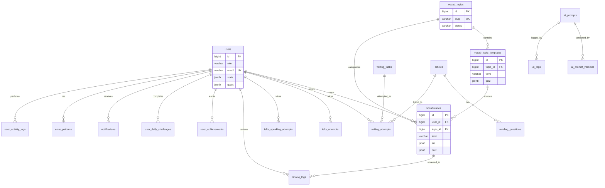
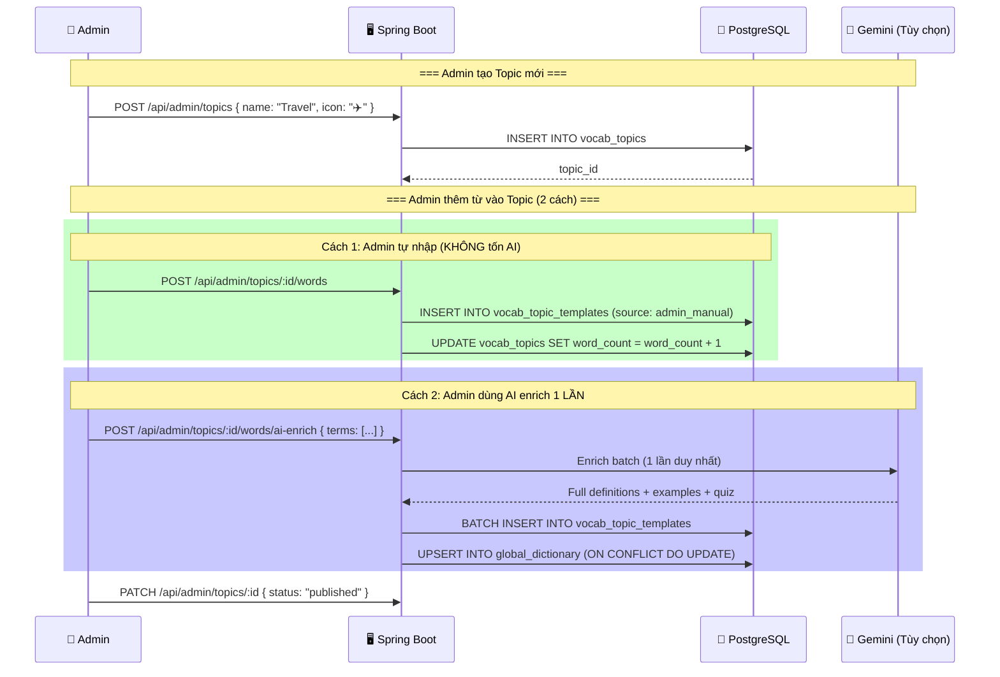
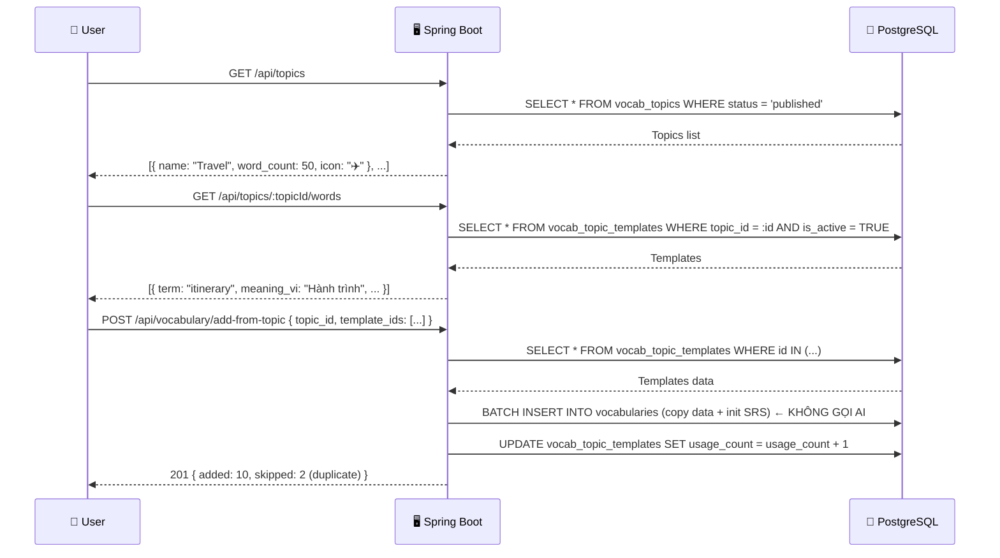
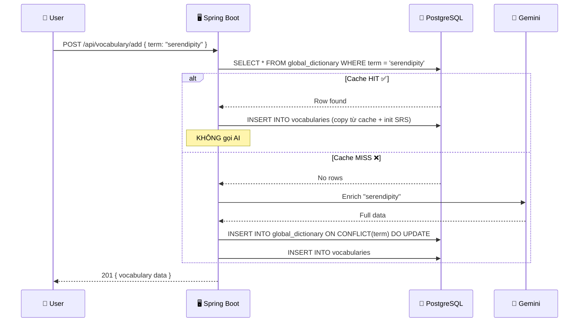
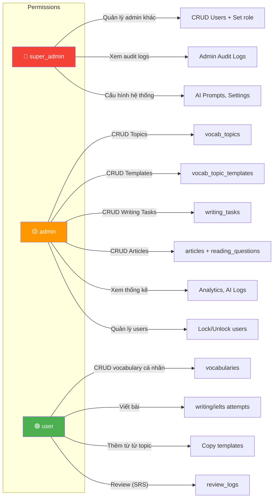

# 🗄️ Database Design — Spring Boot + PostgreSQL

> **Nguyên tắc thiết kế:** Kế thừa toàn bộ chức năng hiện tại + Thêm hệ thống Admin Template + Vocabulary theo chủ đề + Giảm phụ thuộc AI.
> **Database:** PostgreSQL — Free tier trên **Supabase** (500MB) hoặc **Neon.tech** (512MB)
> **ORM:** Spring Data JPA (Hibernate)

---

## 🧠 Chiến Lược Thiết Kế: Hybrid Relational + JSONB

PostgreSQL cho phép kết hợp tốt nhất của cả hai thế giới:

| Dữ liệu | Cách lưu | Lý do |
|---|---|---|
| Core entities (user, vocab, topic) | **Relational tables** + Foreign Keys | Cần JOIN, query, filter, sort |
| Complex nested data (SRS, feedback, quiz, stats) | **JSONB columns** | Cấu trúc phức tạp, ít khi query riêng, tránh table explosion |
| Simple arrays (synonyms, tags) | **TEXT[] hoặc VARCHAR[]** | PostgreSQL hỗ trợ native array |
| Enum values | **VARCHAR + CHECK** | Đơn giản, dễ migrate hơn PostgreSQL ENUM type |

> [!NOTE]
> **Tại sao Hybrid?** Project hiện tại dùng MongoDB với rất nhiều nested data (SRS có 4 mode × 6 fields = 24 fields, feedback có paragraphs, quiz có MCQ arrays...). Nếu normalize hết thành tables riêng sẽ cần ~40 tables + vô số JOINs → Over-engineering cho MVP. JSONB giữ những data này gọn trong 1 column, vẫn queryable khi cần.

---

## 📊 Tổng Quan ERD (Entity Relationship Diagram)



---

## 📋 DDL Chi Tiết Từng Table

### 1. `users` — Người dùng

```sql
CREATE TABLE users (
    id              BIGSERIAL PRIMARY KEY,
    name            VARCHAR(100)    NOT NULL,
    email           VARCHAR(255)    NOT NULL UNIQUE,
    password        VARCHAR(255),                       -- BCrypt hash, NULL cho Google Auth
    
    -- Phân quyền (thay isAdmin)
    role            VARCHAR(20)     NOT NULL DEFAULT 'user'
                    CHECK (role IN ('user', 'admin', 'super_admin')),
    
    -- Account status
    is_locked       BOOLEAN         NOT NULL DEFAULT FALSE,
    is_deleted      BOOLEAN         NOT NULL DEFAULT FALSE,
    deleted_at      TIMESTAMPTZ,
    
    -- OAuth
    google_id       VARCHAR(100),
    picture         TEXT,                                -- Avatar URL
    
    -- Preferences
    writing_level   VARCHAR(20)     DEFAULT 'advanced',
    tone_preference VARCHAR(50)     DEFAULT 'academic/neutral',
    
    -- Stats (JSONB — nested complex, ít query riêng từng field)
    stats           JSONB           NOT NULL DEFAULT '{
        "streak": 0,
        "last_practice_date": null,
        "level": 1,
        "xp": 0,
        "total_words": 0,
        "by_mode": {
            "flashcard":  {"due": 0, "learning": 0, "review": 0, "mastered": 0},
            "quiz":       {"due": 0, "learning": 0, "review": 0, "mastered": 0},
            "typing":     {"due": 0, "learning": 0, "review": 0, "mastered": 0},
            "listening":  {"due": 0, "learning": 0, "review": 0, "mastered": 0}
        },
        "heatmap": {},
        "retention_rate": {"flashcard": 0, "quiz": 0, "typing": 0, "listening": 0}
    }'::jsonb,
    
    -- Goals
    goals           JSONB           NOT NULL DEFAULT '{
        "weekly_writing_target": 3,
        "daily_vocab_target": 20,
        "current_writing_count": 0,
        "current_vocab_count": 0,
        "last_reset_week": null,
        "last_reset_day": null
    }'::jsonb,
    
    joined_at       TIMESTAMPTZ     NOT NULL DEFAULT NOW()
);

-- Indexes
CREATE INDEX idx_users_google_id ON users(google_id) WHERE google_id IS NOT NULL;
CREATE INDEX idx_users_role ON users(role);
CREATE INDEX idx_users_is_deleted ON users(is_deleted) WHERE is_deleted = TRUE;
```

> [!IMPORTANT]
> **Tại sao `stats` và `goals` dùng JSONB?**
> - `stats` chứa 30+ fields lồng nhau (by_mode × 4 mode × 4 counters + heatmap map + retention_rate). Nếu tách ra thành columns riêng → table có 40+ columns, rất khó maintain.
> - Khi cần query: `WHERE stats->>'streak' > '7'` hoặc `stats->'by_mode'->'flashcard'->>'mastered'`.
> - Khi cần sort/leaderboard: Tạo **Generated Column** hoặc **GIN index** cho specific paths.

---

### 2. `vocabularies` — Từ vựng của người dùng

```sql
CREATE TABLE vocabularies (
    id                  BIGSERIAL PRIMARY KEY,
    user_id             BIGINT          NOT NULL REFERENCES users(id) ON DELETE CASCADE,
    
    -- Core data
    term                VARCHAR(200)    NOT NULL,
    meaning_vi          TEXT,
    definition          TEXT,
    type                VARCHAR(30),                    -- noun, verb, adj, adv...
    phonetic            VARCHAR(200),
    ipa                 VARCHAR(200),
    audio               TEXT,                           -- URL phát âm
    
    -- Topic link (MỚI)
    topic_id            BIGINT          REFERENCES vocab_topics(id) ON DELETE SET NULL,
    topic_name          VARCHAR(100),                   -- Denormalized
    
    difficulty          VARCHAR(10)     DEFAULT 'normal'
                        CHECK (difficulty IN ('easy', 'normal', 'hard')),
    original_context    TEXT,
    
    -- Arrays (PostgreSQL native)
    synonyms            TEXT[]          DEFAULT '{}',
    antonyms            TEXT[]          DEFAULT '{}',
    example             TEXT,
    
    -- Complex nested (JSONB)
    collocations        JSONB           DEFAULT '[]'::jsonb,
    -- Format: [{"phrase": "...", "meaning_vi": "..."}]
    
    word_family         JSONB           DEFAULT '{}'::jsonb,
    -- Format: {"noun": "...", "verb": "...", "adjective": "...", "adverb": "..."}
    
    examples            JSONB           DEFAULT '[]'::jsonb,
    -- Format: [{"english": "...", "vietnamese": "..."}]
    
    quiz                JSONB           DEFAULT '{"mcq": []}'::jsonb,
    -- Format: {"mcq": [{"question": "...", "options": [...], "correct_index": 0, "answer": "...", "explanation_vi": "..."}]}
    
    -- SRS (JSONB — 4 modes × 6 fields = 24 fields, perfect cho JSONB)
    srs                 JSONB           NOT NULL DEFAULT '{
        "flashcard":  {"ease_factor": 2.5, "interval_days": 0, "repetitions": 0, "next_review_at": null, "status": "new", "lapses": 0},
        "quiz":       {"ease_factor": 2.5, "interval_days": 0, "repetitions": 0, "next_review_at": null, "status": "new", "lapses": 0},
        "typing":     {"ease_factor": 2.5, "interval_days": 0, "repetitions": 0, "next_review_at": null, "status": "new", "lapses": 0},
        "listening":  {"ease_factor": 2.5, "interval_days": 0, "repetitions": 0, "next_review_at": null, "status": "new", "lapses": 0}
    }'::jsonb,
    
    -- Source tracking (MỚI)
    source              VARCHAR(20)     DEFAULT 'manual'
                        CHECK (source IN ('manual', 'ai_enriched', 'topic_template', 'bulk_import')),
    template_id         BIGINT          REFERENCES vocab_topic_templates(id) ON DELETE SET NULL,
    
    source_sentence_id  BIGINT,                         -- ref: writing_attempts
    added_at            TIMESTAMPTZ     NOT NULL DEFAULT NOW()
);

-- Core indexes
CREATE INDEX idx_vocab_user ON vocabularies(user_id);
CREATE INDEX idx_vocab_user_topic ON vocabularies(user_id, topic_id);
CREATE INDEX idx_vocab_term ON vocabularies(term);
CREATE INDEX idx_vocab_user_source ON vocabularies(user_id, source);

-- SRS query indexes (dùng GIN cho JSONB path queries)
-- Khi query "lấy từ cần review flashcard": WHERE srs->'flashcard'->>'next_review_at' <= NOW()
CREATE INDEX idx_vocab_srs ON vocabularies USING GIN (srs);

-- Hoặc dùng expression index cho performance tốt hơn:
CREATE INDEX idx_vocab_flashcard_review 
    ON vocabularies(user_id, ((srs->'flashcard'->>'next_review_at')::timestamptz));
CREATE INDEX idx_vocab_quiz_review 
    ON vocabularies(user_id, ((srs->'quiz'->>'next_review_at')::timestamptz));
CREATE INDEX idx_vocab_typing_review 
    ON vocabularies(user_id, ((srs->'typing'->>'next_review_at')::timestamptz));
CREATE INDEX idx_vocab_listening_review 
    ON vocabularies(user_id, ((srs->'listening'->>'next_review_at')::timestamptz));

-- Prevent duplicate terms per user
CREATE UNIQUE INDEX idx_vocab_user_term ON vocabularies(user_id, LOWER(term));
```

---

### 3. 🆕 `vocab_topics` — Chủ Đề Từ Vựng (Admin tạo)

```sql
CREATE TABLE vocab_topics (
    id              BIGSERIAL PRIMARY KEY,
    
    name            VARCHAR(100)    NOT NULL,
    name_vi         VARCHAR(100),
    slug            VARCHAR(120)    NOT NULL UNIQUE,
    description     TEXT,
    description_vi  TEXT,
    
    icon            VARCHAR(20),                        -- Emoji: "✈️", "💻"
    color           VARCHAR(10),                        -- Hex: "#FF6B6B"
    cover_image     TEXT,                               -- URL
    
    category        VARCHAR(20)     NOT NULL DEFAULT 'general'
                    CHECK (category IN ('general', 'ielts', 'toeic', 'business', 
                                        'academic', 'daily_life', 'technology', 'other')),
    
    level           VARCHAR(10)     DEFAULT 'mixed'
                    CHECK (level IN ('A1', 'A2', 'B1', 'B2', 'C1', 'C2', 'mixed')),
    
    -- Stats (auto-calculated)
    word_count      INTEGER         NOT NULL DEFAULT 0,
    subscriber_count INTEGER        NOT NULL DEFAULT 0,
    
    -- Ordering & Visibility
    display_order   INTEGER         NOT NULL DEFAULT 0,
    is_featured     BOOLEAN         NOT NULL DEFAULT FALSE,
    status          VARCHAR(15)     NOT NULL DEFAULT 'draft'
                    CHECK (status IN ('draft', 'published', 'archived')),
    
    created_by      BIGINT          REFERENCES users(id),
    updated_by      BIGINT          REFERENCES users(id),
    created_at      TIMESTAMPTZ     NOT NULL DEFAULT NOW(),
    updated_at      TIMESTAMPTZ     NOT NULL DEFAULT NOW()
);

CREATE INDEX idx_topics_status_category ON vocab_topics(status, category);
CREATE INDEX idx_topics_featured ON vocab_topics(status, is_featured) WHERE is_featured = TRUE;
CREATE INDEX idx_topics_order ON vocab_topics(status, display_order);
```

---

### 4. 🆕 `vocab_topic_templates` — Template Từ Vựng (Admin tạo sẵn)

> **Bảng cốt lõi mới.** Admin tạo sẵn từ vựng hoàn chỉnh. User copy vào vocabulary cá nhân → **KHÔNG gọi AI.**

```sql
CREATE TABLE vocab_topic_templates (
    id              BIGSERIAL PRIMARY KEY,
    topic_id        BIGINT          NOT NULL REFERENCES vocab_topics(id) ON DELETE CASCADE,
    
    -- Nội dung từ (Admin điền hoặc AI enrich 1 lần)
    term            VARCHAR(200)    NOT NULL,
    meaning_vi      TEXT,
    definition      TEXT,
    type            VARCHAR(30),
    phonetic        VARCHAR(200),
    ipa             VARCHAR(200),
    audio           TEXT,
    difficulty      VARCHAR(10)     DEFAULT 'normal'
                    CHECK (difficulty IN ('easy', 'normal', 'hard')),
    
    -- Arrays
    synonyms        TEXT[]          DEFAULT '{}',
    antonyms        TEXT[]          DEFAULT '{}',
    example         TEXT,
    
    -- Complex nested (JSONB)
    collocations    JSONB           DEFAULT '[]'::jsonb,
    word_family     JSONB           DEFAULT '{}'::jsonb,
    examples        JSONB           DEFAULT '[]'::jsonb,
    quiz            JSONB           DEFAULT '{"mcq": []}'::jsonb,
    
    -- Template metadata
    display_order   INTEGER         NOT NULL DEFAULT 0,
    is_active       BOOLEAN         NOT NULL DEFAULT TRUE,
    
    content_source  VARCHAR(25)     DEFAULT 'admin_manual'
                    CHECK (content_source IN ('admin_manual', 'admin_ai_generated', 'imported')),
    
    usage_count     INTEGER         NOT NULL DEFAULT 0,
    
    created_by      BIGINT          REFERENCES users(id),
    updated_by      BIGINT          REFERENCES users(id),
    created_at      TIMESTAMPTZ     NOT NULL DEFAULT NOW(),
    updated_at      TIMESTAMPTZ     NOT NULL DEFAULT NOW()
);

CREATE INDEX idx_templates_topic ON vocab_topic_templates(topic_id, display_order);
CREATE INDEX idx_templates_topic_active ON vocab_topic_templates(topic_id, is_active) WHERE is_active = TRUE;
CREATE INDEX idx_templates_term ON vocab_topic_templates(LOWER(term));
CREATE UNIQUE INDEX idx_templates_topic_term ON vocab_topic_templates(topic_id, LOWER(term));
```

> [!TIP]
> **Workflow giảm phụ thuộc AI:**
> ```
> Trước (project cũ):   User thêm từ → Gọi AI enrich MỖI LẦN → tốn quota
> Sau (project mới):    Admin tạo template 1 lần → User chọn topic → Copy template → KHÔNG gọi AI
>                       User vẫn có thể thêm từ tự do → Gọi AI enrich (chỉ khi cần)
> ```

---

### 5. `global_dictionary` — Cache từ điển toàn cục

```sql
CREATE TABLE global_dictionary (
    id              BIGSERIAL PRIMARY KEY,
    term            VARCHAR(200)    NOT NULL UNIQUE,     -- lowercase, trimmed
    
    meaning_vi      TEXT,
    definition      TEXT,
    topic           VARCHAR(100),
    type            VARCHAR(30),
    
    synonyms        TEXT[]          DEFAULT '{}',
    antonyms        TEXT[]          DEFAULT '{}',
    example         TEXT,
    phonetic        VARCHAR(200),
    ipa             VARCHAR(200),
    audio           TEXT,
    
    collocations    JSONB           DEFAULT '[]'::jsonb,
    word_family     JSONB           DEFAULT '{}'::jsonb,
    examples        JSONB           DEFAULT '[]'::jsonb,
    quiz            JSONB           DEFAULT '{"mcq": []}'::jsonb,
    
    usage_count     INTEGER         NOT NULL DEFAULT 1,
    last_updated    TIMESTAMPTZ     NOT NULL DEFAULT NOW()
);

CREATE INDEX idx_gdict_term ON global_dictionary(LOWER(term));
```

---

### 6. `writing_tasks` — Đề bài Writing (Admin tạo)

```sql
CREATE TABLE writing_tasks (
    id              BIGSERIAL PRIMARY KEY,
    title           VARCHAR(300)    NOT NULL,
    slug            VARCHAR(150)    UNIQUE,
    
    input_vi        TEXT            NOT NULL,            -- Đề bài tiếng Việt
    input_en        TEXT,
    expected_output TEXT,
    instructions    TEXT,
    
    -- Helpers (JSONB vì cấu trúc linh hoạt)
    suggested_vocab JSONB           DEFAULT '[]'::jsonb,
    -- Format: [{"term": "...", "meaning": "...", "usage": "..."}]
    key_phrases     TEXT[]          DEFAULT '{}',
    structure_hints TEXT[]          DEFAULT '{}',
    sample_answer   JSONB,
    -- Format: {"content": "...", "explanation": "...", "band_score": 7.0}
    
    task_type       VARCHAR(20)     NOT NULL DEFAULT 'general'
                    CHECK (task_type IN ('general', 'ielts_task1', 'ielts_task2', 
                                         'toeic', 'email', 'essay', 'report', 'letter')),
    tags            TEXT[]          DEFAULT '{}',
    topic           VARCHAR(100),
    level           VARCHAR(5)      DEFAULT 'B1'
                    CHECK (level IN ('A1', 'A2', 'B1', 'B2', 'C1', 'C2')),
    estimated_time_minutes INTEGER  DEFAULT 20,
    word_count_min  INTEGER         DEFAULT 150,
    word_count_max  INTEGER         DEFAULT 250,
    
    status          VARCHAR(15)     NOT NULL DEFAULT 'draft'
                    CHECK (status IN ('draft', 'published', 'archived')),
    is_featured     BOOLEAN         NOT NULL DEFAULT FALSE,
    
    -- Stats
    stats           JSONB           NOT NULL DEFAULT '{"attempts": 0, "completions": 0, "avg_score": 0, "avg_time_minutes": 0}'::jsonb,
    
    created_by      BIGINT          REFERENCES users(id),
    updated_by      BIGINT          REFERENCES users(id),
    created_at      TIMESTAMPTZ     NOT NULL DEFAULT NOW(),
    updated_at      TIMESTAMPTZ     NOT NULL DEFAULT NOW()
);

CREATE INDEX idx_wtask_status_level ON writing_tasks(status, level);
CREATE INDEX idx_wtask_type ON writing_tasks(task_type);
CREATE INDEX idx_wtask_tags ON writing_tasks USING GIN (tags);
CREATE INDEX idx_wtask_featured ON writing_tasks(is_featured, status) WHERE is_featured = TRUE;
```

---

### 7. `writing_attempts` — Bài viết của User

```sql
CREATE TABLE writing_attempts (
    id              BIGSERIAL PRIMARY KEY,
    user_id         BIGINT          NOT NULL REFERENCES users(id) ON DELETE CASCADE,
    
    vi_sentence     TEXT,
    user_sentence   TEXT,
    corrected_sentence TEXT,
    accuracy        REAL,                               -- 0.0-100.0
    
    issues          JSONB           DEFAULT '[]'::jsonb,
    -- Format: [{"type": "tense", "problem": "...", "fix": "...", "reason": "..."}]
    
    article_id      BIGINT          REFERENCES articles(id) ON DELETE SET NULL,
    task_id         BIGINT          REFERENCES writing_tasks(id) ON DELETE SET NULL,
    created_at      TIMESTAMPTZ     NOT NULL DEFAULT NOW()
);

CREATE INDEX idx_wattempt_user ON writing_attempts(user_id, created_at DESC);
```

---

### 8. `ielts_attempts` — Bài IELTS Writing

```sql
CREATE TABLE ielts_attempts (
    id              BIGSERIAL PRIMARY KEY,
    user_id         BIGINT          NOT NULL REFERENCES users(id) ON DELETE CASCADE,
    
    task_type       VARCHAR(10)     NOT NULL CHECK (task_type IN ('task1', 'task2')),
    prompt          TEXT            NOT NULL,
    prompt_image_description TEXT,
    chart_data      JSONB,
    chart_type      VARCHAR(30),
    chart_title     VARCHAR(200),
    
    essay           TEXT            NOT NULL,
    word_count      INTEGER         DEFAULT 0,
    
    -- Scores (relational columns — thường xuyên query, sort, aggregate)
    score_task_achievement  REAL    CHECK (score_task_achievement BETWEEN 0 AND 9),
    score_coherence         REAL    CHECK (score_coherence BETWEEN 0 AND 9),
    score_lexical           REAL    CHECK (score_lexical BETWEEN 0 AND 9),
    score_grammar           REAL    CHECK (score_grammar BETWEEN 0 AND 9),
    score_overall           REAL    CHECK (score_overall BETWEEN 0 AND 9),
    
    -- Feedback (JSONB — nested complex, hiếm khi query riêng)
    feedback        JSONB           DEFAULT '{}'::jsonb,
    -- Format: {
    --   "summary": "...",
    --   "strengths": ["..."],
    --   "weaknesses": ["..."],
    --   "suggestions": ["..."],
    --   "paragraph_feedback": [{"paragraph_index": 0, "content": "...", "issues": [...]}]
    -- }
    
    corrected_essay TEXT,
    time_spent_seconds INTEGER      DEFAULT 0,
    created_at      TIMESTAMPTZ     NOT NULL DEFAULT NOW()
);

CREATE INDEX idx_ielts_user ON ielts_attempts(user_id, created_at DESC);
CREATE INDEX idx_ielts_user_type ON ielts_attempts(user_id, task_type);
CREATE INDEX idx_ielts_score ON ielts_attempts(user_id, score_overall DESC);
```

> [!NOTE]
> **Scores dùng columns riêng thay vì JSONB** vì thường xuyên cần: `ORDER BY score_overall DESC`, `AVG(score_overall)`, `WHERE score_overall >= 6.5`.

---

### 9. `ielts_speaking_attempts` — Bài IELTS Speaking

```sql
CREATE TABLE ielts_speaking_attempts (
    id              BIGSERIAL PRIMARY KEY,
    user_id         BIGINT          NOT NULL REFERENCES users(id) ON DELETE CASCADE,
    
    part            SMALLINT        NOT NULL CHECK (part IN (1, 2, 3)),
    topic           VARCHAR(200)    NOT NULL,
    question        TEXT            NOT NULL,
    audio_duration_seconds INTEGER  DEFAULT 0,
    transcript      TEXT,
    
    -- Scores (columns riêng vì hay query)
    score_fluency       REAL        CHECK (score_fluency BETWEEN 0 AND 9),
    score_lexical       REAL        CHECK (score_lexical BETWEEN 0 AND 9),
    score_grammar       REAL        CHECK (score_grammar BETWEEN 0 AND 9),
    score_pronunciation REAL        CHECK (score_pronunciation BETWEEN 0 AND 9),
    score_overall       REAL        CHECK (score_overall BETWEEN 0 AND 9),
    
    feedback        JSONB           DEFAULT '{}'::jsonb,
    -- Format: {"strengths": [...], "weaknesses": [...], "pronunciation_tips": [...], ...}
    
    created_at      TIMESTAMPTZ     NOT NULL DEFAULT NOW()
);

CREATE INDEX idx_speaking_user ON ielts_speaking_attempts(user_id, created_at DESC);
```

---

### 10. `ielts_prompts` — Đề IELTS (AI-generated)

```sql
CREATE TABLE ielts_prompts (
    id              BIGSERIAL PRIMARY KEY,
    user_id         BIGINT          NOT NULL REFERENCES users(id) ON DELETE CASCADE,
    
    task_type       VARCHAR(10)     NOT NULL CHECK (task_type IN ('task1', 'task2')),
    model_name      VARCHAR(50),
    prompt          TEXT            NOT NULL,
    
    data_description TEXT,
    chart_type      VARCHAR(30),
    chart_title     VARCHAR(200),
    chart_data      JSONB,
    
    sample_ideas    JSONB,          -- {"for": [...], "against": [...]}
    vocabulary_suggestions TEXT[]   DEFAULT '{}',
    key_points      TEXT[]          DEFAULT '{}',
    suggested_structure TEXT[]      DEFAULT '{}',
    generated_outline JSONB,
    
    created_at      TIMESTAMPTZ     NOT NULL DEFAULT NOW()
);

CREATE INDEX idx_iprompt_user ON ielts_prompts(user_id, created_at DESC);
```

---

### 11. `articles` — Bài đọc

```sql
CREATE TABLE articles (
    id              BIGSERIAL PRIMARY KEY,
    guardian_id     VARCHAR(200)    NOT NULL UNIQUE,
    title           VARCHAR(500)    NOT NULL,
    original_url    TEXT,
    published_at    TIMESTAMPTZ,
    source          VARCHAR(20)     DEFAULT 'guardian'
                    CHECK (source IN ('guardian', 'generated')),
    level           VARCHAR(5),
    topic           VARCHAR(100),
    
    sentences       JSONB           NOT NULL DEFAULT '[]'::jsonb,
    -- Format: [{"en": "...", "vi": "...", "order": 0}]
    
    created_at      TIMESTAMPTZ     NOT NULL DEFAULT NOW()
);

CREATE INDEX idx_article_topic ON articles(topic);
CREATE INDEX idx_article_level ON articles(level);
```

---

### 12. `reading_questions` — Câu hỏi bài đọc

```sql
CREATE TABLE reading_questions (
    id              BIGSERIAL PRIMARY KEY,
    article_id      BIGINT          NOT NULL REFERENCES articles(id) ON DELETE CASCADE,
    
    question_type   VARCHAR(15)     NOT NULL DEFAULT 'mcq'
                    CHECK (question_type IN ('mcq', 'true_false', 'fill_blank', 'matching')),
    question_text   TEXT            NOT NULL,
    question_text_vi TEXT,
    
    options         JSONB           DEFAULT '[]'::jsonb,
    -- Format: [{"text": "...", "text_vi": "..."}]
    correct_answer  INTEGER,
    blank_answer    VARCHAR(200),
    blank_hints     TEXT[]          DEFAULT '{}',
    
    explanation     TEXT,
    explanation_vi  TEXT,
    reference_sentence_index INTEGER,
    
    difficulty      VARCHAR(10)     DEFAULT 'medium'
                    CHECK (difficulty IN ('easy', 'medium', 'hard')),
    display_order   INTEGER         DEFAULT 0,
    
    stats           JSONB           NOT NULL DEFAULT '{"attempts": 0, "correct_count": 0}'::jsonb,
    
    created_by      BIGINT          REFERENCES users(id),
    created_at      TIMESTAMPTZ     NOT NULL DEFAULT NOW()
);

CREATE INDEX idx_rq_article ON reading_questions(article_id, display_order);
```

---

### 13. `review_logs` — Lịch sử ôn tập

```sql
CREATE TABLE review_logs (
    id              BIGSERIAL PRIMARY KEY,
    user_id         BIGINT          NOT NULL REFERENCES users(id) ON DELETE CASCADE,
    vocab_id        BIGINT          NOT NULL REFERENCES vocabularies(id) ON DELETE CASCADE,
    
    rating          VARCHAR(10)     NOT NULL CHECK (rating IN ('again', 'hard', 'good', 'easy')),
    review_mode     VARCHAR(15)     NOT NULL DEFAULT 'flashcard'
                    CHECK (review_mode IN ('flashcard', 'quiz', 'typing', 'listening')),
    
    reviewed_at     TIMESTAMPTZ     NOT NULL DEFAULT NOW(),
    previous_interval INTEGER,
    new_interval    INTEGER,
    
    is_extra_practice BOOLEAN       DEFAULT FALSE,
    is_custom_session BOOLEAN       DEFAULT FALSE,
    time_taken      INTEGER,                            -- seconds
    was_overdue     BOOLEAN         DEFAULT FALSE
);

CREATE INDEX idx_review_user ON review_logs(user_id, reviewed_at DESC);
CREATE INDEX idx_review_vocab ON review_logs(vocab_id, reviewed_at DESC);
```

---

### 14. `ai_prompts` — Quản lý Prompt AI (Admin)

```sql
CREATE TABLE ai_prompts (
    id              BIGSERIAL PRIMARY KEY,
    prompt_key      VARCHAR(50)     NOT NULL UNIQUE,
    name            VARCHAR(200)    NOT NULL,
    description     TEXT,
    category        VARCHAR(20)     DEFAULT 'other'
                    CHECK (category IN ('writing', 'vocabulary', 'translation', 'ielts', 'feedback', 'other')),
    
    system_prompt   TEXT            NOT NULL,
    user_prompt_template TEXT       NOT NULL,
    
    variables       JSONB           DEFAULT '[]'::jsonb,
    -- Format: [{"name": "{{var}}", "description": "...", "data_type": "string", "required": true}]
    
    model_config    JSONB           NOT NULL DEFAULT '{
        "preferred_models": [],
        "temperature": 0.7,
        "max_tokens": 2000,
        "top_p": 1,
        "frequency_penalty": 0,
        "presence_penalty": 0
    }'::jsonb,
    
    output_format   VARCHAR(15)     DEFAULT 'json'
                    CHECK (output_format IN ('text', 'json', 'markdown', 'html')),
    output_schema   JSONB,
    
    version         INTEGER         NOT NULL DEFAULT 1,
    is_active       BOOLEAN         NOT NULL DEFAULT TRUE,
    is_system       BOOLEAN         NOT NULL DEFAULT FALSE,
    
    usage_count     INTEGER         NOT NULL DEFAULT 0,
    last_used_at    TIMESTAMPTZ,
    
    created_by      BIGINT          REFERENCES users(id),
    updated_by      BIGINT          REFERENCES users(id),
    created_at      TIMESTAMPTZ     NOT NULL DEFAULT NOW(),
    updated_at      TIMESTAMPTZ     NOT NULL DEFAULT NOW()
);

CREATE INDEX idx_aiprompt_category ON ai_prompts(category);
CREATE INDEX idx_aiprompt_active ON ai_prompts(is_active) WHERE is_active = TRUE;
```

---

### 15. `ai_prompt_versions` — Lịch sử Prompt

```sql
CREATE TABLE ai_prompt_versions (
    id              BIGSERIAL PRIMARY KEY,
    prompt_id       BIGINT          NOT NULL REFERENCES ai_prompts(id) ON DELETE CASCADE,
    prompt_key      VARCHAR(50)     NOT NULL,
    version         INTEGER         NOT NULL,
    
    system_prompt   TEXT            NOT NULL,
    user_prompt_template TEXT       NOT NULL,
    variables       JSONB           DEFAULT '[]'::jsonb,
    model_config    JSONB,
    output_format   VARCHAR(15),
    output_schema   JSONB,
    
    change_note     TEXT,
    change_type     VARCHAR(15)     DEFAULT 'update'
                    CHECK (change_type IN ('create', 'update', 'rollback', 'import')),
    diff_info       JSONB,
    
    created_by      BIGINT          REFERENCES users(id),
    created_at      TIMESTAMPTZ     NOT NULL DEFAULT NOW(),
    
    UNIQUE(prompt_id, version)
);

CREATE INDEX idx_aipv_prompt ON ai_prompt_versions(prompt_id, version DESC);
CREATE INDEX idx_aipv_key ON ai_prompt_versions(prompt_key, version DESC);
```

---

### 16. `ai_logs` — Log tương tác AI

```sql
CREATE TABLE ai_logs (
    id              BIGSERIAL PRIMARY KEY,
    user_id         BIGINT          REFERENCES users(id) ON DELETE SET NULL,
    
    request_type    VARCHAR(30)     NOT NULL,
    prompt_key      VARCHAR(50),
    prompt_version  INTEGER,
    model_name      VARCHAR(50)     NOT NULL,
    
    input_data      JSONB,          -- {"system_prompt": "...(truncated)", "user_prompt": "...", "full_input_length": 1234}
    output_data     JSONB,          -- {"content": "...(truncated)", "full_output_length": 5678}
    
    processing_time_ms INTEGER,
    tokens_used     JSONB,          -- {"prompt_tokens": 100, "completion_tokens": 200, "total_tokens": 300}
    
    status          VARCHAR(20)     NOT NULL DEFAULT 'success'
                    CHECK (status IN ('success', 'error', 'timeout', 'rate_limited', 'invalid_response')),
    error_info      JSONB,          -- {"code": "...", "message": "...", "stack": "..."}
    context_info    JSONB,          -- {"feature": "...", "action": "...", "session_id": "..."}
    metadata        JSONB,          -- {"ip_address": "...", "user_agent": "..."}
    
    created_at      TIMESTAMPTZ     NOT NULL DEFAULT NOW()
);

CREATE INDEX idx_ailog_user ON ai_logs(user_id, created_at DESC);
CREATE INDEX idx_ailog_type ON ai_logs(request_type, created_at DESC);
CREATE INDEX idx_ailog_status ON ai_logs(status, created_at DESC) WHERE status != 'success';
CREATE INDEX idx_ailog_created ON ai_logs(created_at DESC);

-- Xóa logs cũ: Dùng pg_cron hoặc scheduled job trong Spring Boot
-- DELETE FROM ai_logs WHERE created_at < NOW() - INTERVAL '30 days';
```

> [!NOTE]
> **PostgreSQL không có TTL index** như MongoDB. Thay vào đó, dùng:
> - **pg_cron** extension (Supabase hỗ trợ sẵn): `SELECT cron.schedule('0 3 * * *', $$DELETE FROM ai_logs WHERE created_at < NOW() - INTERVAL '30 days'$$);`
> - Hoặc **Spring Boot @Scheduled** chạy cleanup job hàng ngày.

---

### 17. `user_achievements` — Thành tích

```sql
CREATE TABLE user_achievements (
    id              BIGSERIAL PRIMARY KEY,
    user_id         BIGINT          NOT NULL REFERENCES users(id) ON DELETE CASCADE,
    achievement_id  VARCHAR(30)     NOT NULL,            -- 'streak_7', 'vocab_100'
    
    unlocked_at     TIMESTAMPTZ     NOT NULL DEFAULT NOW(),
    progress        INTEGER         NOT NULL DEFAULT 0,
    notified        BOOLEAN         NOT NULL DEFAULT FALSE,
    
    UNIQUE(user_id, achievement_id)
);

CREATE INDEX idx_achieve_user ON user_achievements(user_id);
```

---

### 18. `user_daily_challenges` — Thử thách hàng ngày

```sql
CREATE TABLE user_daily_challenges (
    id              BIGSERIAL PRIMARY KEY,
    user_id         BIGINT          NOT NULL REFERENCES users(id) ON DELETE CASCADE,
    challenge_date  DATE            NOT NULL,            -- Thay String bằng DATE type
    
    challenges      JSONB           NOT NULL DEFAULT '[]'::jsonb,
    -- Format: [{"challenge_id": "review_10", "target": 10, "progress": 0, "completed": false, "completed_at": null, "xp_claimed": false}]
    
    all_completed   BOOLEAN         NOT NULL DEFAULT FALSE,
    bonus_claimed   BOOLEAN         NOT NULL DEFAULT FALSE,
    
    created_at      TIMESTAMPTZ     NOT NULL DEFAULT NOW(),
    
    UNIQUE(user_id, challenge_date)
);

CREATE INDEX idx_daily_user ON user_daily_challenges(user_id, challenge_date DESC);
```

---

### 19. `notifications` — Thông báo

```sql
CREATE TABLE notifications (
    id              BIGSERIAL PRIMARY KEY,
    user_id         BIGINT          NOT NULL REFERENCES users(id) ON DELETE CASCADE,
    
    type            VARCHAR(30)     NOT NULL,
    title           VARCHAR(200)    NOT NULL,
    message         VARCHAR(1000)   NOT NULL,
    data            JSONB,
    
    is_read         BOOLEAN         NOT NULL DEFAULT FALSE,
    created_at      TIMESTAMPTZ     NOT NULL DEFAULT NOW()
);

CREATE INDEX idx_notif_user_unread ON notifications(user_id, is_read, created_at DESC);
CREATE INDEX idx_notif_user_type ON notifications(user_id, type, created_at DESC);
-- Cleanup: DELETE FROM notifications WHERE created_at < NOW() - INTERVAL '30 days';
```

---

### 20. `error_patterns` — Lỗi phổ biến của User

```sql
CREATE TABLE error_patterns (
    id              BIGSERIAL PRIMARY KEY,
    user_id         BIGINT          NOT NULL REFERENCES users(id) ON DELETE CASCADE,
    
    error_type      VARCHAR(30),                        -- 'tense', 'collocation', 'structure'
    pattern         TEXT,
    occurrence_count INTEGER        NOT NULL DEFAULT 0,
    last_seen       TIMESTAMPTZ
);

CREATE INDEX idx_errpat_user ON error_patterns(user_id);
```

---

### 21. `admin_audit_logs` — Nhật ký Admin

```sql
CREATE TABLE admin_audit_logs (
    id              BIGSERIAL PRIMARY KEY,
    admin_id        BIGINT          NOT NULL REFERENCES users(id),
    admin_email     VARCHAR(255)    NOT NULL,
    
    action          VARCHAR(20)     NOT NULL
                    CHECK (action IN ('create', 'read', 'update', 'delete', 'login', 
                                      'logout', 'export', 'import', 'bulk_update', 'rollback')),
    resource_type   VARCHAR(25)     NOT NULL
                    CHECK (resource_type IN ('user', 'vocabulary', 'article', 'writing_task', 
                                             'ai_prompt', 'ielts_prompt', 'settings', 'system',
                                             'vocab_topic', 'vocab_template')),
    resource_id     BIGINT,
    resource_name   VARCHAR(200),
    
    old_value       JSONB,
    new_value       JSONB,
    metadata        JSONB,          -- {"ip_address", "user_agent", "request_path", "request_method", "affected_count"}
    
    status          VARCHAR(10)     NOT NULL DEFAULT 'success'
                    CHECK (status IN ('success', 'failed', 'partial')),
    error_message   TEXT,
    
    created_at      TIMESTAMPTZ     NOT NULL DEFAULT NOW()
);

CREATE INDEX idx_audit_admin ON admin_audit_logs(admin_id, created_at DESC);
CREATE INDEX idx_audit_resource ON admin_audit_logs(resource_type, created_at DESC);
CREATE INDEX idx_audit_created ON admin_audit_logs(created_at DESC);
-- Cleanup: DELETE FROM admin_audit_logs WHERE created_at < NOW() - INTERVAL '90 days';
```

---

### 22. `user_activity_logs` — Log hoạt động User

```sql
CREATE TABLE user_activity_logs (
    id              BIGSERIAL PRIMARY KEY,
    user_id         BIGINT          NOT NULL REFERENCES users(id) ON DELETE CASCADE,
    
    action          VARCHAR(50)     NOT NULL,            -- 'login', 'add_vocab', 'review_vocab'
    resource_type   VARCHAR(20)     NOT NULL
                    CHECK (resource_type IN ('auth', 'writing', 'vocabulary', 'article', 'ielts', 'gamification')),
    resource_id     BIGINT,
    details         JSONB,
    metadata        JSONB,                              -- {"ip_address", "user_agent", "platform"}
    
    created_at      TIMESTAMPTZ     NOT NULL DEFAULT NOW()
);

CREATE INDEX idx_uactl_user ON user_activity_logs(user_id, created_at DESC);
CREATE INDEX idx_uactl_action ON user_activity_logs(action);
CREATE INDEX idx_uactl_created ON user_activity_logs(created_at DESC);
-- Cleanup: DELETE FROM user_activity_logs WHERE created_at < NOW() - INTERVAL '60 days';
```

---

## 🔄 Luồng Hoạt Động Chính

### Luồng 1: Admin Tạo Topic + Template Từ Vựng



### Luồng 2: User Thêm Từ Từ Topic (KHÔNG gọi AI)



### Luồng 3: User Thêm Từ Tự Do (AI với cache fallback)



---

## 📏 Ước Tính Dung Lượng (500MB Free Tier)

| Table | Avg Row Size | 1000 Users Estimate | Total |
|---|---|---|---|
| `users` | ~1.5 KB | 1,000 rows | ~1.5 MB |
| `vocabularies` | ~2.5 KB | 50/user × 1,000 | ~125 MB |
| `vocab_topics` | ~0.4 KB | ~50 rows | < 0.1 MB |
| `vocab_topic_templates` | ~1.5 KB | 50 × 30 = 1,500 | ~2.3 MB |
| `global_dictionary` | ~1.5 KB | ~5,000 unique | ~7.5 MB |
| `writing_tasks` | ~2 KB | ~100 rows | ~0.2 MB |
| `writing_attempts` | ~0.8 KB | 20/user × 1,000 | ~16 MB |
| `ielts_attempts` | ~4 KB | 10/user × 1,000 | ~40 MB |
| `review_logs` | ~0.2 KB | 200/user × 1,000 | ~40 MB |
| `ai_logs` (cleanup 30d) | ~1.5 KB | ~10,000 active | ~15 MB |
| `notifications` (cleanup 30d) | ~0.4 KB | ~5,000 active | ~2 MB |
| **Indexes + overhead** | - | - | ~30 MB |
| **TỔNG** | | | **~280 MB** |

> [!TIP]
> **PostgreSQL thường nhẹ hơn MongoDB ~20%** nhờ không lưu field names mỗi document. Dư ~220MB trên gói 500MB free. An toàn cho < 1000 users.

---

## 🔑 Phân Quyền Admin



---

## 📁 Mapping: MongoDB → PostgreSQL

| MongoDB Collection | PostgreSQL Table | Key Changes |
|---|---|---|
| `User` | `users` | `isAdmin` → `role` VARCHAR. `stats/goals` → JSONB. Bỏ `gemini_api_key` |
| `Vocabulary` | `vocabularies` | Nested arrays/objects → JSONB. SRS → JSONB. Thêm `topic_id`, `source` |
| `GlobalDictionary` | `global_dictionary` | Arrays → TEXT[]. Nested → JSONB |
| — | 🆕 `vocab_topics` | **MỚI** |
| — | 🆕 `vocab_topic_templates` | **MỚI** |
| `WritingTask` | `writing_tasks` | Arrays → TEXT[]. Nested → JSONB |
| `WritingAttempt` | `writing_attempts` | `issues` array → JSONB |
| `IeltsAttempt` | `ielts_attempts` | Scores → individual columns (queryable). Feedback → JSONB |
| `IeltsSpeakingAttempt` | `ielts_speaking_attempts` | Same pattern as ielts_attempts |
| `IeltsPrompt` | `ielts_prompts` | Arrays → TEXT[]. Chart data → JSONB |
| `Article` | `articles` | `sentences` array → JSONB |
| `ReadingQuestion` | `reading_questions` | `options` → JSONB. `blank_hints` → TEXT[] |
| `ReviewLog` | `review_logs` | Direct mapping, all relational |
| `AIPrompt` | `ai_prompts` | `variables`, `model_config` → JSONB |
| `AIPromptVersion` | `ai_prompt_versions` | Same |
| `AILog` | `ai_logs` | All nested → JSONB. No TTL → scheduled cleanup |
| `Achievement` (constants) | Constants + `user_achievements` | Same |
| [DailyChallenge](file:///c:/Users/Acer%20Nitro%205/Documents/writing-practice/backend/models/DailyChallenge.js#156-191) (constants) | Constants + `user_daily_challenges` | `date` String → DATE type |
| `Notification` | `notifications` | `read` → `is_read`. No TTL → scheduled cleanup |
| `ErrorPattern` | `error_patterns` | `count` → `occurrence_count` (avoid reserved word) |
| `AdminAuditLog` | `admin_audit_logs` | Thêm resource types. No TTL → scheduled cleanup |
| `UserActivityLog` | `user_activity_logs` | Same |

---

## ⚠️ PostgreSQL vs MongoDB — Những Điểm Cần Lưu Ý

| Tính năng | MongoDB (cũ) | PostgreSQL (mới) | Giải pháp |
|---|---|---|---|
| **TTL Index** (tự xóa docs cũ) | ✅ Native `expireAfterSeconds` | ❌ Không có | `pg_cron` hoặc `@Scheduled` Spring |
| **Flexible Schema** | ✅ Schemaless | ❌ Fixed schema | JSONB columns cho data linh hoạt |
| **Array Operations** | ✅ `$push`, `$pull` | ⚠️ Phức tạp hơn | TEXT[] + `array_append()` hoặc JSONB |
| **Nested Query** | ✅ Dot notation tự nhiên | ⚠️ JSONB operators (`->`, `->>`) | Expression indexes cho performance |
| **Atomic Update nested** | ✅ `$set: {"a.b.c": val}` | ⚠️ `jsonb_set()` verbose hơn | Helper methods trong Repository |
| **ACID Transactions** | ⚠️ Hỗ trợ nhưng hạn chế | ✅ Full ACID, mature | Tận dụng `@Transactional` Spring |
| **JOINs** | ❌ `$lookup` chậm | ✅ Native, tối ưu | Tận dụng cho reports, analytics |
| **Free Hosting** | Atlas M0 (500MB, vĩnh viễn) | Supabase (500MB) / Neon (512MB) | Cả hai đều đủ |

---

## 🏗️ Spring Data JPA Config

```yaml
# application.yml
spring:
  datasource:
    url: ${DATABASE_URL}               # jdbc:postgresql://host:5432/dbname
    username: ${DB_USERNAME}
    password: ${DB_PASSWORD}
    driver-class-name: org.postgresql.Driver
  jpa:
    hibernate:
      ddl-auto: validate               # Production: validate only
    properties:
      hibernate:
        dialect: org.hibernate.dialect.PostgreSQLDialect
    show-sql: false
    open-in-view: false                 # Performance best practice
```

```xml
<!-- pom.xml dependencies -->
<dependency>
    <groupId>org.postgresql</groupId>
    <artifactId>postgresql</artifactId>
    <scope>runtime</scope>
</dependency>
<dependency>
    <groupId>com.vladmihalcea</groupId>
    <artifactId>hibernate-types-60</artifactId>
    <version>2.21.1</version>
    <!-- Cho JSONB mapping trong JPA Entity -->
</dependency>
```

> [!IMPORTANT]
> **JSONB trong JPA Entity** cần `hibernate-types` library của Vlad Mihalcea. Ví dụ:
> ```java
> @Type(JsonBinaryType.class)
> @Column(columnDefinition = "jsonb")
> private Map<String, Object> stats;
> ```

---

## 🎯 Tóm Tắt

| Hạng mục | Chi tiết |
|---|---|
| **Tổng số tables** | **22** (16 giữ nguyên + 2 mới + 4 sửa đổi) |
| **Tables mới** | `vocab_topics`, `vocab_topic_templates` |
| **Tables sửa đổi** | `users`, `vocabularies`, `admin_audit_logs`, `user_daily_challenges` |
| **Dung lượng ước tính** | ~280 MB / 500 MB free tier |
| **Giảm AI dependency** | ~80% → ~20% nhờ template system |
| **ORM** | Spring Data JPA + Hibernate + hibernate-types (JSONB) |
| **Migration tool** | Flyway hoặc Liquibase (khuyến nghị Flyway cho đơn giản) |
